# Facial Similarity Matching Code Explanation and Results

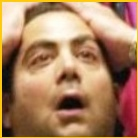

## Introduction

&nbsp;&nbsp;&nbsp;&nbsp;This document includes all the explanations of the code and the database for facial similarity. The code is separated into two files. 
The first file is the main file where all functions that display the results will be displayed to perform the similarity and the CosineSimilarityHog file contains functions, 
class, and constant to perform the computation and display all the values. 
This document also include all the techniques used to perform image processing for facial similarity comparison. I use the cosine similarity formula by using two feature extraction vectors from the histogram of oriented gradients from two images which are the test image and all the images inside the database.

## Database Explianation

The database folder name “Face_similarity_DB” include two folders
 
* Data > Folder contains all data image in the database
    * Images > Another folder where it leads to all images
        * All the images

* test > Folder contains all test image in the database
    * Images > Another folder where it leads two subfolder
        * inDatabase > Folder contain all test image include in database
            * All the images
        * notInDatabase > Folder contain all test image not include in database
            * All the images

## Methods

### Cosine Similarity:

&nbsp;&nbsp;&nbsp;&nbsp;Cosine similarity is a metric used to measure the similarity between two vectors. In this case, I use the feature extraction vector from histogram of oriented gradients from two images. The formula is shown below

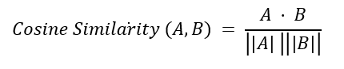

&nbsp;&nbsp;&nbsp;&nbsp;The dot product is calculated by multiplying the corresponding elements of the vectors and summing the results. The Euclidean norm is calculated as the square root of the sum of the squares of the individual elements in the vector. 

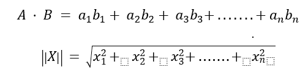

&nbsp;&nbsp;&nbsp;&nbsp;In my code implementation. I use functions from numpy libraries to perform both dot products and Euclidean norm and use basic division given by Python. The result of this calculate is the similarity percentage between two images used in the code

### Histogram of Oriented Gradient:

#### Gradient Matrix Computation:

&nbsp;&nbsp;&nbsp;&nbsp;First, I have to create a gradient matrix from the image. There are two gradient matrices which are in the x and y directions represent the intensity of the image changes in the horizontal (x) and vertical (y) directions. To perform the calculation at each value inside the matrix. I decide to use the Sobel operator to perform a convolution between the Sobel kernel and the corresponding neighborhood of pixels in the input image. The Sobel operator consists of two 3x3 convolution kernels, one for detecting changes in the horizontal direction Sobel_x and the other for changes in the vertical direction Sobel_y

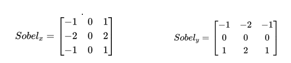

Each value in the gradient matrix can be calculated by using this formula

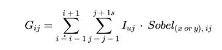

The gradient matrix calculation can be represented by using this formula for both horizontal and vertical direction

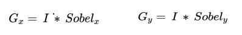

In my implementation, I use the Sobel function from OpenCV to calculate the gradient in both directions

### Compute Gradient Magnitude and Orientation:

&nbsp;&nbsp;&nbsp;&nbsp;Since we have both gradient matrics, We can now find the matrix of gradient magnitude and orientation. The magnitude matrix represents the magnitude of the gradient vectors at each corresponding pixel. The values indicate the strength of the intensity change at each point. The orientation matrix represents the orientation of the gradient vectors at each corresponding pixel. The values indicate the direction of the intensity change in degrees.
 

The gradient magnitude at a given point is computed using the formula:

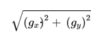

The gradient orientation of a given point is computed using the formula:

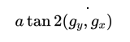

The atan2 function returns the angle whose tangent is the quotient of the two specified numbers
 

In my code implementation, I use the OpenCV library to access the cartToPolar() formula to get both matrices

### Create Histograms within blocks:

&nbsp;&nbsp;&nbsp;&nbsp;Now, I create a 3d array for organizing and storing histograms. The first two dimensions of the histogram correspond to the spatial divisions of the image into blocks. Each block is considered a spatial region, and histograms within each block are computed. The third dimension corresponds to the number of orientation bins. Each value in this dimension of the array represents the histogram for a specific orientation bin within a block. As the code iterates over each orientation bin, it computes and stores the histogram for that orientation within the appropriate block in the histogram array.
 

&nbsp;&nbsp;&nbsp;&nbsp;For the iteration part, the loop iterates over each orientation bin, where each iteration creates a mask of logical AND operations where it’s true for pixels within the current orientation range. I use the binary mask to select the magnitudes of gradients that fall within the current orientation range. After applying the binary mask, at each pixel, I calculate the sum of all rows and columns from the given neighborhood of the image and then combine both value. Example display below

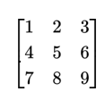

Column = [1+4+7, 2+5+8, 3+6+9] = [12, 15, 18]
 
Row = [1+2+3, 4+5+6, 7+8+9]= [6, 15, 24]
 
Result = Combine both arrays and add every value together
 

&nbsp;&nbsp;&nbsp;&nbsp;The result is a 1D array where each element represents the sum of magnitudes for pixels within the current orientation bin and the specified block. This 1D array is assigned to the corresponding slice of the histogram array, effectively storing the histogram for the current orientation within the current block
 

&nbsp;&nbsp;&nbsp;&nbsp;In my programming implementation, The initialized histogram was created by a numpy function called zeros where I made it a 3d array of 0. The mask was created with the numpy function logical_and, and the sum function also from the numpy function
 

The result of performing all of these operations is to get the histogram of the oriented gradient which will be used for creating a feature extraction vector for each image

### Concatenated normalized block histograms to form the feature vector:

&nbsp;&nbsp;&nbsp;&nbsp;After I got the histogram array,  each 2D block was flattened into a 1D array, and then all the flattened blocks were concatenated into a single 1D feature vector. The feature vector is divided by its L2 norm (Euclidean norm)to ensure that the result has a length (magnitude) of 1. Euclidean norm formula was already explained in the cosine similarity formula 
 

&nbsp;&nbsp;&nbsp;&nbsp;In my implementation, I flatted each 2D array using the ravel() function and concatenated all flattened blocks with the concatenate function from numpy. The Euclidean norm is also calculated by using numpy library. The result of this operation is the feature extraction vector from the image which will be used in the cosine similarity formula to calculate the similarity between two feature extraction vector from two images

## Main file code explanation

&nbsp;&nbsp;&nbsp;&nbsp;Before the result is displayed, I have to import the CosineSimilarityHOG file to import all the necessary items to perform the face similarity matching class. After 
importing the file, I wanted to show all the result function for all the image. First, I
initialize a class to perform the similarity matching by initializing the test image file and number to determine if the file is inside the database or not. If the number is 1, then the image is inside the database. Otherwise, if the number is 0, and the image is not inside the database. 
 

&nbsp;&nbsp;&nbsp;&nbsp;I called printSimilarity() function to print all the similarity percentages between the test image and all the images inside the database and also called the similarityResult() function to display the name and the picture of the person in the image if the test image is include in database, and display the name and two images where the first image is the test image and target image with the highest similarity if the test image is not 

## CosineSimilarityHOG file code explanation

&nbsp;&nbsp;&nbsp;&nbsp;Before performing any computation, display, etc. I have to explain all the necessary libraries to perform all the tasks. The NumPy library contains all the mathematics functions and array-related operations. Use the Mathplotlib.pyplot library to plot the result image. cv2 library to load the image and preprocess the image before the image processing process. Lastly, the os library to access the file by joining the folder path to access the file.
 

&nbsp;&nbsp;&nbsp;&nbsp;There are mainly 3 constants in this program. The first one is the constant size of the image which is width by height for resizing the image when computing the histogram. The constant contains the name of the main database folder. The list contains all the image files inside the database which is not the test image.
 

&nbsp;&nbsp;&nbsp;&nbsp;The file contains a class Similarity which contains all the functions to perform cosineSimilarity using feature extraction vectors from two images for comparison. The initialize function is the initializes the name of the test file and the number that determines if the test file is inside the database or not. If the number is 1, then the image is inside the database. Otherwise, if the number is 0, and the image is not inside the database.
 

&nbsp;&nbsp;&nbsp;&nbsp;The accessTestFile() function is a function to get the image file in the test folder. This function also knows if the image is inside the database or not by using the inDatabase value. The accessTargetFile() is to get the image file in the data folder (database). imageResize() function is the resize the image based on the imageScale constant declared in the file. fileNameDelete() function is used to get the name of the file by deleting the file type (file type string after the full stop).
 

&nbsp;&nbsp;&nbsp;&nbsp;The compute_hog() function is to create a feature extraction vector from the histogram of Oriented Gradients from images. The first step is to create a gradient arry for both the x and y directions using the cv2. Sobel function which uses Sobel kernel for both x and y direction. The second step is to compute the gradient magnitude and orientation (angle) matrix using cv2cartToPolar() function. The third step is to create a histogram by creating a 3D array that divides the image into blocks, and each block contains multiple cells that have a dimension corresponding to the calculation. Then, use a for loop to iterate over each orientation bin and calculate histograms for pixels with orientations falling within the current range. After getting the histogram, we concatenate normalized block histograms to form the feature vector, and lastly calculate the Euclidean norm (L2)for the feature vector divide it with the feature vector, and return this value as the result
 

&nbsp;&nbsp;&nbsp;&nbsp;cosineSimilarity_HOG() is the function to compute the similarity percentage using the cosine similarity formula with a feature vector from two images. similarityList() function creates a list of similarities between the test image and all the images inside the database. The function will iterate over all the images in the database to compute a feature extraction vector for two images which are the test image and each image from the database, and find the similarity value, and then put it in the similarity list. printSimilarity() function is to print the list of similarity percentages between the test image and all the images inside the database. Lastly, similarityResult() prints the message of who is in the picture and shows the image result. If the test image is inside the database it will tell who is in the picture and the image of that person. Otherwise, It will tell that the test image is similar to which image in the database. The message will display the similarity percentage and also the picture of both the test image and the image in the database with the highest similarity

## Result

### If the test image is inside the database

#### Similarity List

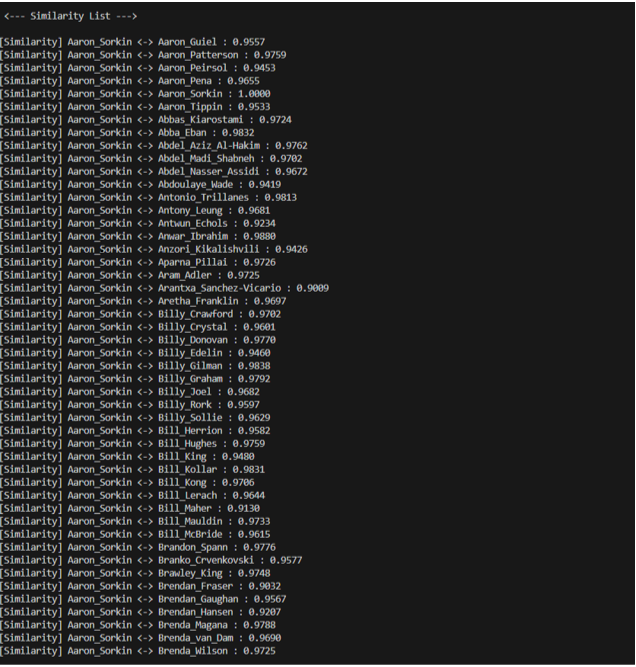

#### Result Message

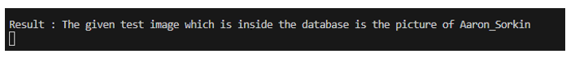

#### Image Result:

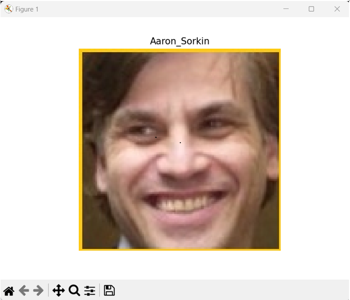

### If the test image is not inside the database

#### Similarity List

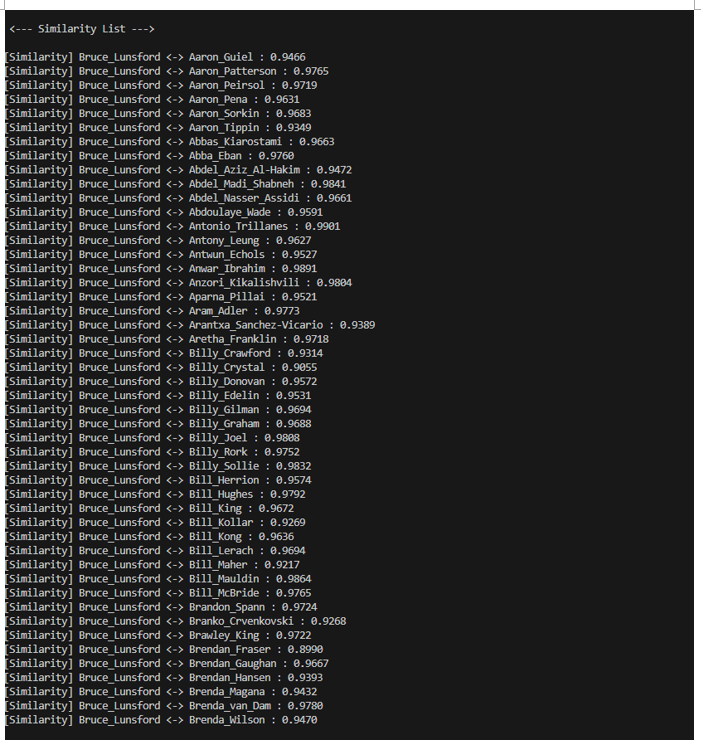

#### Result Message

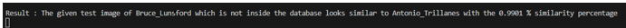

#### Image Result:

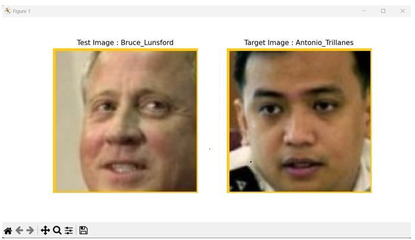

### Print all the result from the test image that are in the database and doesn’t

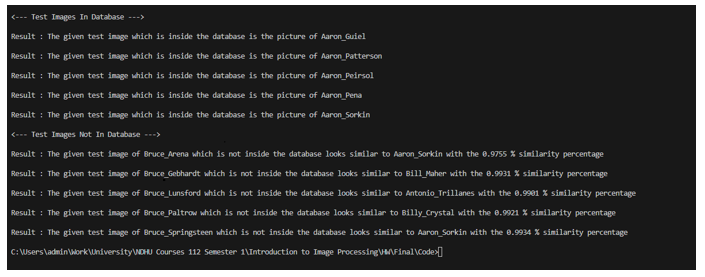
